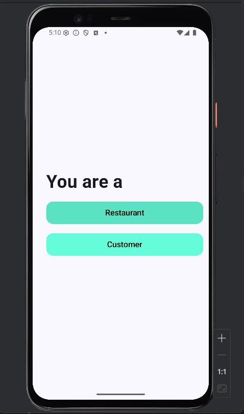
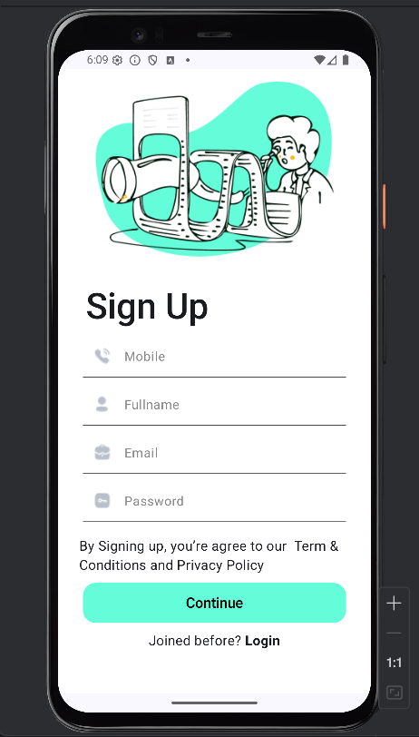
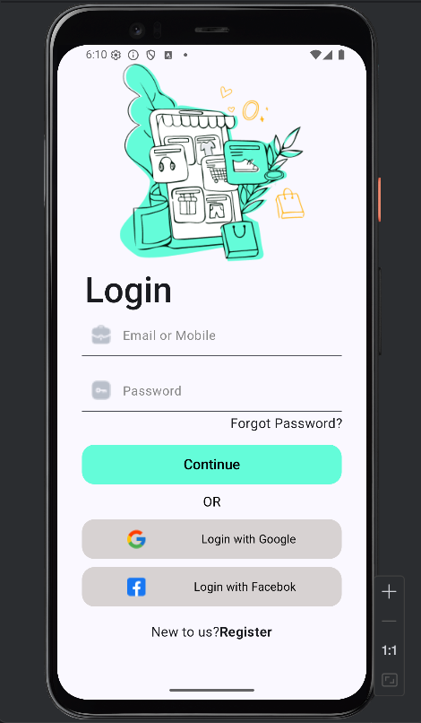
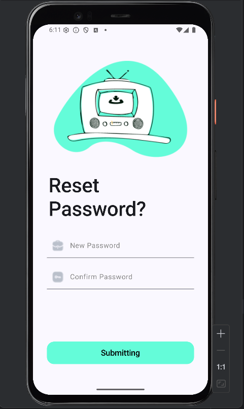
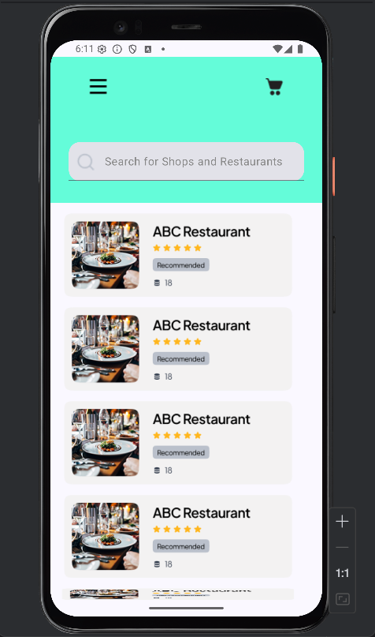
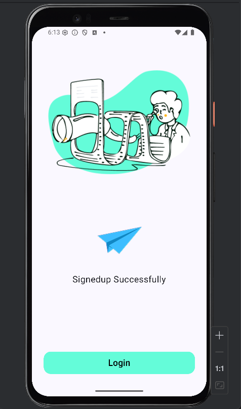

Jetpack Compose Based Design
This project contains 7 different screens created using the modern Android UI development library Jetpack Compose and is designed entirely with Compose components.
Jetpack Compose Features Used
1. Basic Compose Components
Column, Row → Used to align UI elements vertically and horizontally.
Text → Used to display text.
Image / Icon → Used to display images and icons.
Spacer → Used to create spacing between components.

2. Interactive Components
Button → Clickable buttons.
TextField → Used to collect user input.
IconButton or Modifier.clickable → Makes icons clickable.

3. Navigation Between Screens
NavHost → Defines all the screens (composables) in the app.
NavController → Manages navigation between screens.
composable("screenName") → Declares a route for each screen.
navController.navigate("TargetScreen") → Triggers navigation to a specific screen.

4. Theme and Design Customizations
MaterialTheme → Defines the overall app theme.
ButtonDefaults, TextFieldDefaults → Used to customize color schemes and component appearance.
RoundedCornerShape, Modifier.size(), Modifier.padding() → Used to shape and style UI elements.

5. State Management
remember { mutableStateOf("") } → Used to manage and observe UI state such as user input or dynamic values within Composables.

6.Screenshots

